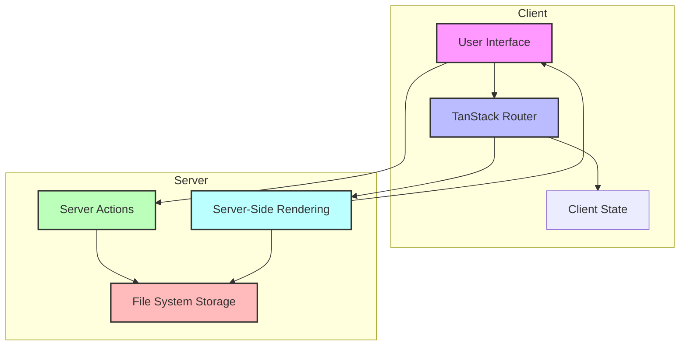
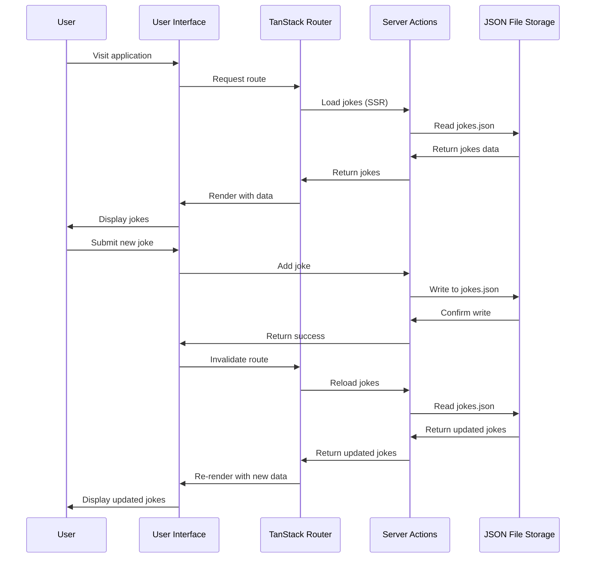
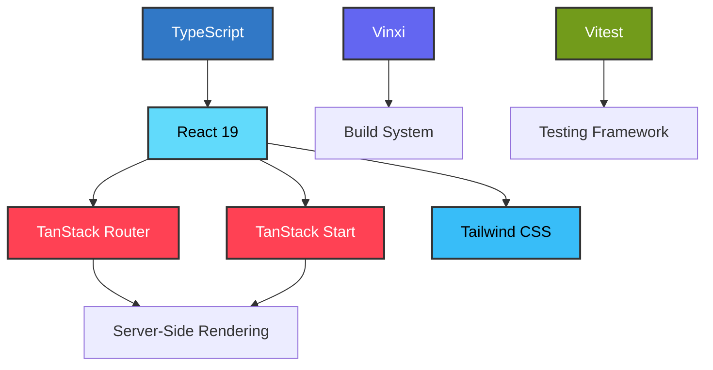

# DevJokes Architecture

The following diagram illustrates the architecture of the DevJokes application.

## System Architecture

```mermaid
graph TD
    subgraph "Client"
        UI[User Interface]
        Router[TanStack Router]
        ClientState[Client State]
    end

    subgraph "Server"
        SSR[Server-Side Rendering]
        ServerActions[Server Actions]
        FileSystem[File System Storage]
    end

    UI --> Router
    Router --> ClientState
    Router --> SSR
    UI --> ServerActions
    ServerActions --> FileSystem
    SSR --> FileSystem
    SSR --> UI

    style UI fill:#f9f,stroke:#333,stroke-width:2px
    style Router fill:#bbf,stroke:#333,stroke-width:2px
    style ServerActions fill:#bfb,stroke:#333,stroke-width:2px
    style FileSystem fill:#fbb,stroke:#333,stroke-width:2px
    style SSR fill:#bff,stroke:#333,stroke-width:2px
```

## Data Flow

```mermaid
sequenceDiagram
    participant User
    participant UI as User Interface
    participant Router as TanStack Router
    participant ServerAction as Server Actions
    participant Storage as JSON File Storage

    User->>UI: Visit application
    UI->>Router: Request route
    Router->>ServerAction: Load jokes (SSR)
    ServerAction->>Storage: Read jokes.json
    Storage->>ServerAction: Return jokes data
    ServerAction->>Router: Return jokes
    Router->>UI: Render with data
    UI->>User: Display jokes

    User->>UI: Submit new joke
    UI->>ServerAction: Add joke
    ServerAction->>Storage: Write to jokes.json
    Storage->>ServerAction: Confirm write
    ServerAction->>UI: Return success
    UI->>Router: Invalidate route
    Router->>ServerAction: Reload jokes
    ServerAction->>Storage: Read jokes.json
    Storage->>ServerAction: Return updated jokes
    ServerAction->>Router: Return updated jokes
    Router->>UI: Re-render with new data
    UI->>User: Display updated jokes
```

## Technology Stack

```mermaid
graph TD
    React[React 19] --> TanStackRouter[TanStack Router]
    React --> TanStackStart[TanStack Start]
    TanStackRouter --> SSR[Server-Side Rendering]
    TanStackStart --> SSR
    React --> TailwindCSS[Tailwind CSS]
    TypeScript[TypeScript] --> React
    Vinxi[Vinxi] --> BuildSystem[Build System]
    Vitest[Vitest] --> Testing[Testing Framework]

    style React fill:#61dafb,stroke:#333,stroke-width:2px,color:#000
    style TypeScript fill:#3178c6,stroke:#333,stroke-width:2px,color:#fff
    style TanStackRouter fill:#ff4154,stroke:#333,stroke-width:2px,color:#fff
    style TanStackStart fill:#ff4154,stroke:#333,stroke-width:2px,color:#fff
    style TailwindCSS fill:#38bdf8,stroke:#333,stroke-width:2px,color:#000
    style Vinxi fill:#6366f1,stroke:#333,stroke-width:2px,color:#fff
    style Vitest fill:#729b1b,stroke:#333,stroke-width:2px,color:#fff
```
