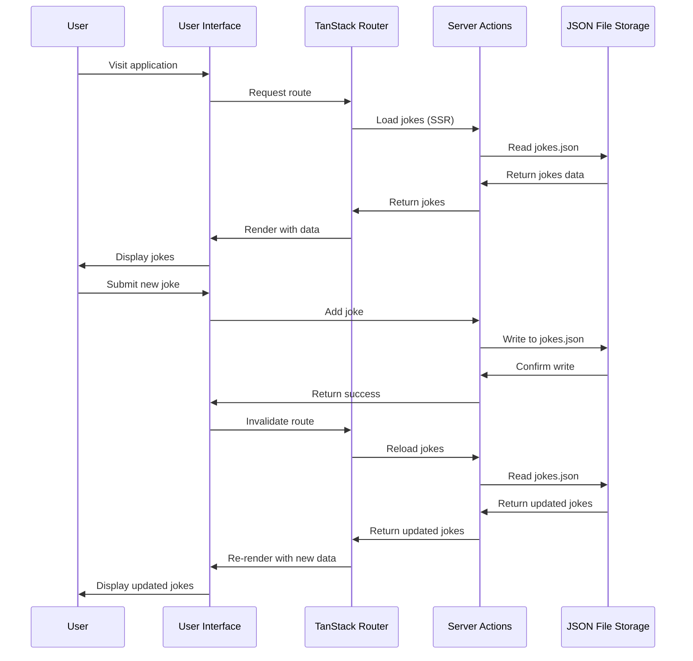

# DevJokes

A full-stack web application for collecting and sharing developer jokes, built with React, TanStack Router, and server-side rendering.

[](https://www.youtube.com/watch?v=zd0rtKbtlgU)


## 🚀 Features

- Add new developer jokes with questions and punchlines
- View a collection of developer jokes
- Server-side rendering for improved performance
- File-based routing with TanStack Router
- Server actions for data manipulation
- Responsive design with Tailwind CSS

## 📋 Prerequisites

- [Node.js](https://nodejs.org/) (v18 or higher)
- [pnpm](https://pnpm.io/) (v8 or higher)

## 🛠️ Installation

1. Clone the repository:
   ```bash
   git clone https://github.com/yourusername/devjokes.git
   cd devjokes
   ```

2. Install dependencies:
   ```bash
   pnpm install
   ```

3. Start the development server:
   ```bash
   pnpm dev
   ```

4. Open [http://localhost:3000](http://localhost:3000) in your browser.

## 🏗️ Project Structure

```
devjokes/
├── public/              # Static assets
├── src/
│   ├── api/             # API endpoints
│   ├── components/      # Reusable UI components
│   │   └── ui/          # Basic UI components
│   ├── data/            # JSON data storage
│   ├── features/        # Feature-specific components
│   │   └── jokes/       # Jokes feature components
│   ├── routes/          # File-based routes
│   ├── serverActions/   # Server-side actions
│   ├── types/           # TypeScript type definitions
│   ├── client.tsx       # Client entry point
│   ├── router.tsx       # Router configuration
│   └── ssr.tsx          # Server-side rendering setup
├── app.config.ts        # Application configuration
├── tailwind.config.js   # Tailwind CSS configuration
└── tsconfig.json        # TypeScript configuration
```

## 🚢 Deployment

Build the application for production:

```bash
pnpm build
```

Preview the production build locally:

```bash
pnpm serve
```

## 🧪 Testing

Run tests with Vitest:

```bash
pnpm test
```

## 🔧 Technologies Used

- [React](https://react.dev/) - UI library
- [TypeScript](https://www.typescriptlang.org/) - Type safety
- [TanStack Router](https://tanstack.com/router) - File-based routing
- [TanStack React Start](https://tanstack.com/start) - Server-side rendering
- [Tailwind CSS](https://tailwindcss.com/) - Utility-first CSS framework
- [Vinxi](https://vinxi.vercel.app/) - Build system
- [Vitest](https://vitest.dev/) - Testing framework

## 📝 How It Works

DevJokes uses a simple file-based JSON storage system to store and retrieve jokes. The application leverages TanStack Router for routing and TanStack React Start for server-side rendering.

## Data Flow



### Adding a Joke

1. Enter a joke question and answer in the form
2. Submit the form to add the joke to the collection
3. The joke is stored in a JSON file on the server
4. The UI automatically updates to display the new joke

### Server Actions

The application uses server actions to:
- Fetch jokes from the server
- Add new jokes to the collection
- Delete jokes from the collection

## 🤝 Contributing

Contributions are welcome! Please feel free to submit a Pull Request.

1. Fork the repository
2. Create your feature branch (`git checkout -b feature/amazing-feature`)
3. Commit your changes (`git commit -m 'Add some amazing feature'`)
4. Push to the branch (`git push origin feature/amazing-feature`)
5. Open a Pull Request

## 📄 License

This project is licensed under the MIT License - see the LICENSE file for details.

## 🙏 Acknowledgments

- [TanStack](https://tanstack.com/) for their excellent libraries
- All contributors who have helped improve this project
